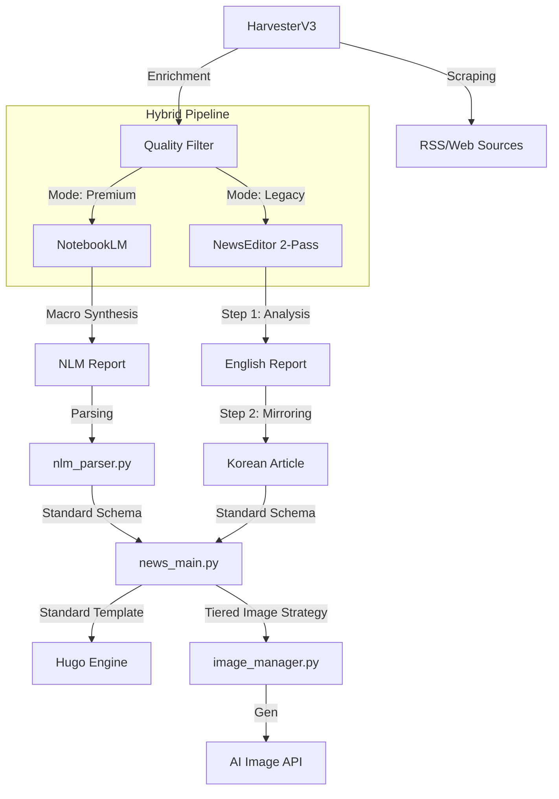

# 🗺️ SYSTEM_MAP: 뉴스 자동화 아키텍처

## 🏗️ 전체 구조

## 📂 주요 모듈 및 역할
- **`automation/news_main.py`**: 표준 템플릿 엔진 및 전체 파이프라인 총괄 (언어 통합 처리)
- **`automation/ai_news_editor.py`**: Legacy 모드 전용 2-Pass 고품질 분석 에디터 (Ironclad Protocol v1.1)
- **`automation/ai_writer.py`**: 다중 모델 오케스트레이터 및 20초 Throttling 제어
- **`automation/notebooklm_publisher.py`**: Premium(NLM) 리포트 배포 오케스트레이터
- **`automation/image_manager.py`**: Tiered Image Strategy (원본 -> 라이브러리 -> 생성) 담당
- **`automation/nlm_parser.py`**: NLM 마크다운 분석 및 표준 스키마 변환

## 🏷️ 대분류 및 태그 체계 (Standard v2.0)
- **Clusters (대분류)**: `ai`, `hardware`, `insights`
- **Categories (중분류)**: `models`, `apps`, `chips`, `high-end`, `analysis`, `guide`
