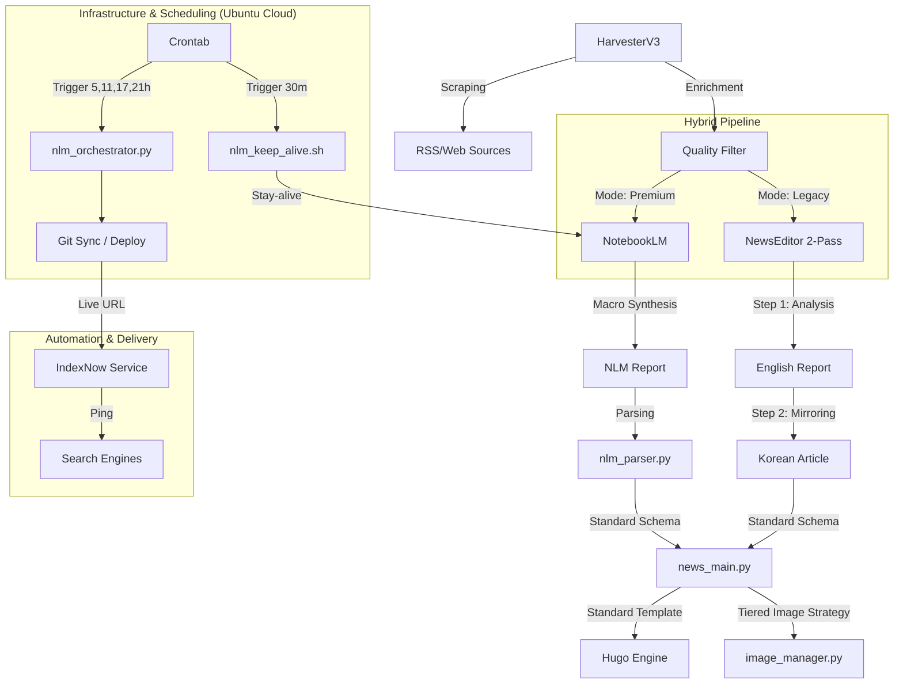

# 🗺️ SYSTEM_MAP: 뉴스 자동화 아키텍처

## 🏗️ 전체 구조

## 📂 주요 모듈 및 역할
- **`automation/news_main.py`**: 표준 템플릿 엔진 및 전체 파이프라인 총괄 (언어 통합 처리)
- **`automation/nlm_orchestrator.py`**: Premium(NLM) 전체 공정(수확->생성->배포) 오케스트레이터 [v1.7]
- **`automation/notebooklm_publisher.py`**: NLM 리포트 파싱 및 기사 발행 유틸리티
- **`automation/indexnow_service.py`**: 검색 엔진 실시간 인덱싱 요청 (Naver 멀티 키 지원)
- **`automation/nlm_keep_alive.sh`**: 1시간 주기 NLM 세션 유지(Stay-alive) 스크립트 [v2.0]
- **`automation/crontab_config.txt`**: Ubuntu 클라우드 전체 스케줄링 가이드 [v2.0]

## 🚀 특이사항
- **Full Automation**: Premium 모드는 수확부터 리포트 대기, 발행, Git Push(배포), IndexNow까지 단일 명령으로 처리.
- **IndexNow v1.3**: Naver Search Advisor 통합 및 도메인별 개별 키(News 전용) 매핑 로직 추가.
- **Git Sync**: 로컬에서 생성된 기사를 자동으로 GitHub에 반영하여 라이브 사이트 실시간 업데이트.

## 🏷️ 대분류 및 태그 체계 (Standard v2.0)
- **Clusters (대분류)**: `ai`, `hardware`, `insights`
- **Categories (중분류)**: `models`, `apps`, `chips`, `high-end`, `analysis`, `guide`
