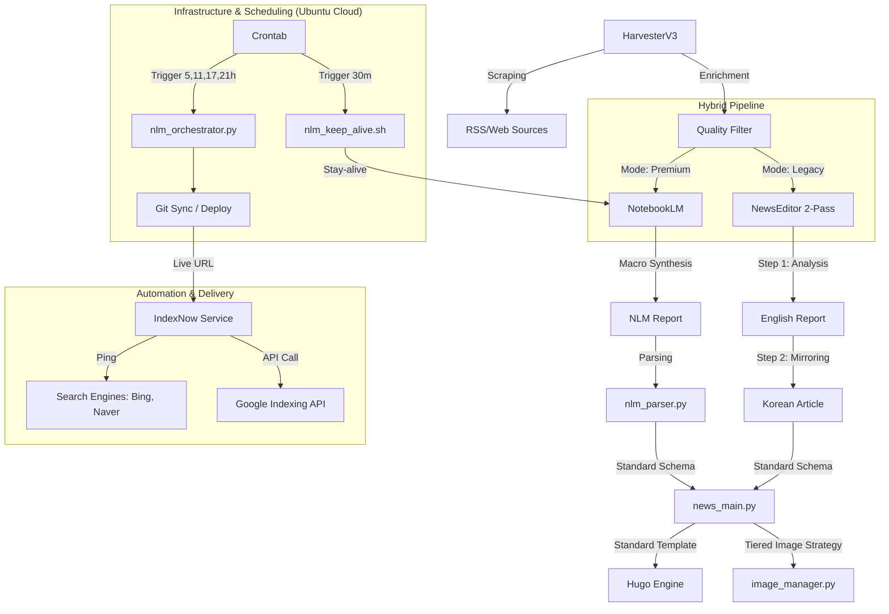

# 🗺️ SYSTEM_MAP: 뉴스 자동화 아키텍처

## 🏗️ 전체 구조

## 📂 주요 모듈 및 역할
- **`automation/news_main.py`**: 표준 템플릿 엔진 및 전체 파이프라인 총괄 (언어 통합 처리)
- **`automation/nlm_orchestrator.py`**: Premium(NLM) 전체 공정(수확->생성->배포) 오케스트레이터 [v1.7]
- **`automation/notebooklm_publisher.py`**: NLM 리포트 파싱 및 기사 발행 유틸리티
- **`automation/indexnow_service.py`**: 검색 엔진 실시간 인덱싱 통합 허브 (Bing, Naver IndexNow + Google Indexing API 호출 연동)
- **`automation/google_indexing_service.py`**: Google Indexing API(Service Account) 전용 통신 모듈 [v1.4]
- **`automation/nlm_keep_alive.sh`**: 1시간 주기 NLM 세션 유지(Stay-alive) 스크립트 [v2.0]
- **`automation/crontab_config.txt`**: Ubuntu 클라우드 전체 스케줄링 가이드 [v2.0]
- **`automation/reprocess_reports.py`**: 파싱 오류 또는 필드 누락 시 기존 리포트를 지능형 로직으로 재발행하는 긴급 복구 모듈 [v4.9]
- **`automation/telegram_bridge.py`**: 텔레그램 알림 송신 및 사용자 지침 수신을 처리하는 양방향 브릿지 [v5.0]
- **`automation/notify.py`**: 다양한 작업 완료 시 상태를 요약하여 보고하는 통합 알림 CLI [v5.0]
- **`automation/image_manager.py`**: 프로젝트 루트 `static` 폴더를 기준으로 이미지를 통합 관리하는 Tiered Strategy 허브 [v6.2]
  - [v6.2] **WebP 전환 파이프라인**: `Pillow` 라이브러리를 도입하여 모든 다운로드 및 생성 이미지를 WebP 포맷(Quality 85)으로 자동 변환, LCP 성능을 극대화합니다.
  - [v6.2] **Alt Text 자동화**: 프런트매터의 `alt_text` 필드를 지원하여 AI가 생성한 이미지 설명을 검색 엔진에 전달합니다.
  - [v5.0] **국문 상세 분석 헤더 충돌 방지**: 본문 내 `##` 헤더를 `###`로 자동 다운그레이드하여 계층 충돌을 방지합니다.
  - [v3.0] 이미지 생성 및 검색 기준을 프로젝트 루트 `/static`으로 일원화하여 배포 누락을 방지합니다.
- **`layouts/partials/seo.html`**: 구글/빙/네이버 통합 SEO 최적화 허브 [v12.0]
  - [v12.0] **Hreflang & x-default**: 다국어(ko/en) 간의 관계를 명시하여 글로벌 검색 엔진 타겟팅을 최적화합니다.
  - [v12.0] **Schema.org 고도화**: `hugo.toml`의 파라미터를 활용해 `NewsArticle` 구조화 데이터를 완벽히 구현합니다.

## 15. 통합 SEO 마스터 전략 (Ironclad SEO v1.0)
### [설계 의도]
단순 노출을 넘어 AI 검색(Copilot, Gemini)의 답변 근거(Grounding)로 채택되고, 구글의 Core Web Vitals 지표를 정복하기 위한 기술적/콘텐츠적 통합 전략입니다.

### [핵심 로직]
1. **AI 답변 최적화 (Copilot Grounding)**:
   - **Executive Summary Box**: 기사 최상단에 강조된 요약 박스를 배치하여 AI가 핵심 정보를 즉시 추출하도록 설계했습니다. (`single.html`)
   - **Independent Completeness**: NLM/API 프롬프트에 '독립적 완결성' 요구사항을 추가하여 외부 링크 없이도 풍부한 정보를 제공합니다.
2. **기술적 SEO (Technical Mastery)**:
   - **Hreflang & x-default**: 다국어 문서 간의 언어적 관계를 명시하여 검색 결과의 정확도를 높입니다. (`seo.html`)
   - **Schema.org NewsArticle**: `hugo.toml`의 메타데이터를 활용해 구조화 데이터를 자동 완성합니다.
3. **이미지 성능 최적화 (LCP/CLS)**:
   - **WebP & FetchPriority**: 차세대 포맷과 우선순위 로딩(`fetchpriority="high"`)을 통해 초기 로딩 속도를 최적화합니다.
   - **Alt Text 자동화**: AI가 생성한 프롬프트를 Alt 텍스트로 활용하여 시각 자료의 색인 가능성을 높입니다.

### [의존성]
- `hugo.toml` -> SEO 메타데이터 관리
- `layouts/_default/single.html` -> 요약 박스 및 이미지 로딩 로직
- `automation/image_manager.py` -> WebP 변환 엔진 (Pillow 의존)

## 🚀 특이사항
- **Full Automation**: Premium 모드는 수확부터 리포트 대기, 발행, Git Push(배포), IndexNow까지 단일 명령으로 처리.
- **IndexNow v1.3**: Naver Search Advisor 통합 및 도메인별 개별 키(News 전용) 매핑 로직 추가.
- **Git Sync**: 로컬에서 생성된 기사를 자동으로 GitHub에 반영하여 라이브 사이트 실시간 업데이트.

## 🏷️ 대분류 및 태그 체계 (Standard v2.0)
- **Clusters (대분류)**: `ai`, `hardware`, `insights`
- **Categories (중분류)**: `models`, `apps`, `chips`, `high-end`, `analysis`, `guide`
